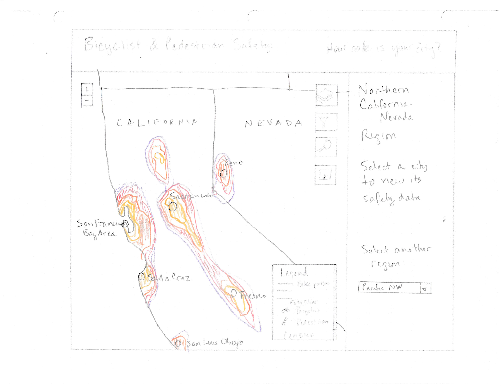
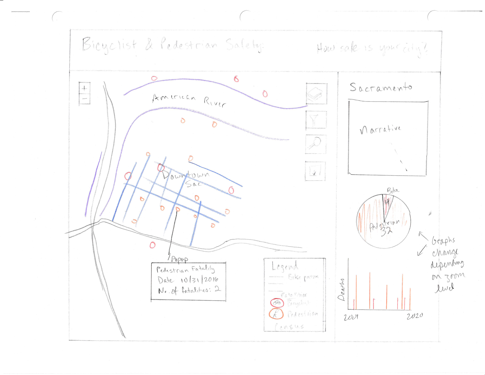

# Final Proposal, Revised

## Team Name
Team More Than Just Cars

### Team Members
Rachael Urbano and Gerald Heston

## Overview
The hypothesis is that the bicyclist- and pedestrian-related incidents are likely going to fall outside of areas that incorporate bicycle and pedestrian infrastructure, and we do not mean just "paint on the pavement." Projects supported by spatial data (where fatalities are occurring) often help cities secure needed funding from agencies like Department of Transportation or Community Development Block Grants (CDBG) funding [CDBG HUD Gov Program](https://www.hud.gov/program_offices/comm_planning/cdbg#:~:text=The%20Community%20Development%20Block%20Grant,%2D%20and%20moderate%2Dincome%20persons.), which is determined by certain eligibilities with the Department of Housing and Urban Development.  Whether driven by curiosity or project need, a user should be able to retrieve the data they are seeking for a given area with ease. A recent example being in Sparks, Nevada where federal funding was secured to improve pedestrian ramps which would likely accommodate those with mobility impairments [Sparks Federal Funding]( https://www.bidnet.com/closed-government-contracts/2023-cdbg-pedestrian-infrastructure-improvements-federally-funded?itemId=817558321).There exists places within our analysis that have no footpaths or pedestrian paths. 

In some instancessuch as Reno, the city has seen explosive growth the last two decades and the building has incorporated cyclist infrastructure with it. We are in agreement that as a country, we are a bit far off from being like Amsterdam, but people are realizing the need for change, and the benefits to everyone when there is infrastructure available. As cities continue to grow and expand, we argue that planning must include pedestrian and cyclist infrastructure. The untold benefits of a healthier society seem to not be important enough to people so instead we must plead a case. 

In Los Angeles there are bike coalitions and groups that get together regularly, promote events (such as [CicLAvia]( https://www.ciclavia.org/about) where 7 miles of streets are shut down and devoted to bike paths for the day, occurring 3-4 times a year). They show up to public meetings regarding metro public transit, and local governance meetings as a voice to be heard. So having specific areas to bring to the attention of local governments could prove useful. 

The purpose of this application is to support bicyclists, pedestrians, and local governments to assess the success of bike and pedestrian infrastructure projects. First the user will be presented a map over the general  center of California and Nevada. We have chosen to highlight data from metropolitan areas in this region - these will be highlighted on the map, and the user will be prompted to select a metro area. Then the map will zoom into the metro area, where the data will be presented at an appropriate scale. It is worth noting, the two states have quite different population sizes, the main metros are included for both states. In total there are 41 metro areas (some are micropolitan areas). There exist eight regions in Nevada and the remaining thirty-three are located in California. This final count may be reduced, but again the varying population sizes are more comparable to the rest of America.
We will provide narratives of how the cities have implemented cycleways and pedestrian areas in varying locations in this set of metros. Map users can see what typeof bike/pedestrian infrastructure exists  . We seek to identify any trends that may be present within the data e.g., high number of deaths to an unproportionate population size, cities that have high cyclist ridership with low deaths.The user will be able to turn layers on and off, filter the fatalities by year (or type), and search for an address. As the user zooms/pans, the charts in the sidebar will update to show the data within the window.

The final product will make proper use of a relevant filter, perhaps a widget would allow the data to be downloaded in csv format at the click of a button, basic geoprocessing functions (closest bike infrastructure feature (cycleway or pedway), clip features), and a few standard map operators such as: zoom, pan, basemap options. In this instance, by applying a filter and perhaps the clip function, a user can capture the geospatial data of accidents and fatalities in a given area and have the ability to export this data for further use.

## Persona/Scenario
Our target audience includes a wide breadth of user groups:
1. General bike enthusiasts, pedestrians, and motorists.
Hector is a recreational cyclist who is interested in learning which intersections or streets in his city have the lowest accident rates. Hector would like to plan a day ride and travel on the safest streets. When he goes to the website, he will choose his city from the popdown menu on the right. Then the map zooms to his city. The first map will include data points of bicyclist and pedestrian deaths. The base map is of the city with bike lanes and cycleways highlighted. On the right will be a pie chart of the number of bike/ped deaths, and a bar chart of # of deaths over time . As Hector zooms and pans, the charts will update. He can turn on or off the bike/ped layers using the layer control. If the city has a narrative attached, he can read about the city’s infrastructure plans. He can also search for an address or landmark using the search tool.

* A general bike enthusiast or pedestrian is curious about where bicyclist/pedestrian deaths are occurring in their community. They may want to avoid streets or intersections with a high accident rates. They might want to travel on streets/paths with low accident rates, or streets with successful bike/pedestrian infrastructure. This in turn, can influence a cyclist’s decision in the same way  a motorist may want to avoid routes with high use by bicyclists and pedestrians, just to avoid causing an accident. Also, they may want to bring certain streets/intersections to the attention of the city council or city planners for improvements.
* The general enthusiast toggle on the layers that are of interest and explore the maps. The user should be able to turn on and off layers such as accident sites, speed limits. They can search for intersections or addresses. To what level they seek to gain information would vary. Sometimes people just stumble upon things or it can be a source of inspiration. 
* Consider this, someone is planning a day trip to cycle 40 mi to a new location and they stumble upon our map. It would be good to highlight some areas that have been known to have accidents. As a cyclist it is important to have a planned route and have an idea what the day ahead looks like. Sure, that tree-lined path looks nice for a daytime bike ride but have there been any notable incidents on that route?
2. City planners
* Toggling around this map will help with considerations as cities around the country seek to pedestrianize areas. There is a growing need to utilize space in denser areas of populations.  A new type of mixed-use multi-level development with business storefronts on the first level often seeks to capitalize on that foot traffic and anticipated density, with it means adding sidewalk and slowly converting streets into bike lanes, good city planning is seeking to incorporate non-automobile related infrastructure. The city planner will assess intersections that have had a higher bicycle/pedestrian death ratio. 
Daniel, a city planner from Fresno works at the City of Carson. Daniel comes from an agricultural region of the state and grew up having to cycle to school in his youth and walk to the bus stop to get to high school. He knows the dangers that cyclists and youth face when on their ways to school. Going away to college in Chico, Daniel grew accustomed to the pedestrian friendly area. Walking to classes, going to the farmer’s market during the weekdays and having a bike trail nearby on the weekend really helped blow off steam throughout his undergrad. Daniel now working for the city, has been tasked with beautifying the Carson and Avalon Intersection off of the 405 freeway. This area is just about finished with adding four multistory apartments nearby a grocery center and the Carson City Hall. The new buildings have restaurant business storefronts and seeks to make the area safer for the daytime working crowd (and nearby Cal State Dominguez Hills) and student population. Daniel suggests where placing a crosswalk might be beneficial for people on the street to utilize reaching the storefronts and grocery complex coming from the west. Daniel looks at the census tracts to see where ridership is highest and takes note to compare this to the city master street plan. Daniel will use this information to see where a proposed bike lane could be added. 
* As mixed-use planning is transforming urban neighborhoods, cities have looked at starting point as to where that pedestrian infrastructure is needed. Where are there gaps for people to make use of civic amenities? Examples include new developments that are adjacent to downtown hubs. Identifying existing infrastructure could help encourage local residents and the daytime working crowd to utilize these spaces. Even though pedestrianized areas only account for 1% of the Land Cover in the US, these pedestrianized areas have been proven to account for 20% of the GDP [Foot Traffic Report](Foot Traffic Ahead 2023 - Smart Growth America).
* Small scale transportation efforts and bikeshare efforts could also utilize this data to see where a good amount of the target audience is located. 

3. Data analysts and engineers
* The more advanced user such as the city data analyst (or engineer in the planning department that looks over roads), may want to apply some spatial analysis tools such as proximity to a dedicated bike path or infrastructure, or look at a city as a whole and calculate the rate of change in the occurrences of bicyclist accidents or deaths. Engineers may want to assess the area to see if Bott’s Dot’s can be used to block off a turning section for bikes.
* The Bott’s Dots [What are Bott’s Dots, one of many road innovations for safety](https://en.wikipedia.org/wiki/Botts%27_dots) being just an example of infrastructure that is meant to serve as a barrier to protect community members. Other times viewing pedestrianized areas and the incidence of accidents can help engineers plead for the need to place reflective crosshatch paint for crosswalks. Anywhere is a good start towards a more mobile society. And unfortunately, there are areas without even designated crosswalks. Other times it is to get a case study of daytime populations.
Nadja with the City of Las Vegas has been tasked with increasing the safety along the Boulder Highway Route. Since 2001 there have been 102 deaths. All of the deaths were located in areas without sidewalk or just near a cycleway path. There exists platforms for bus stops, but they are paired with sidewalks that end abruptly. Some stops have nothing besides a pole in the ground. To encourage users to utilize the transit system and increase safety for pedestrians, Nadja inspects the map. Looking at the map Nadja gains insight into: where the deaths are occurring, where there is a lack of infrastructure in relation to the deaths, and locations to implement the installation of Bott’s Dots nearby cycle trails or bus stops to protect users from cars. 
* All projects need one crucial thing: A responsible leader campaigning for change within their city. Leaders come in all forms, but having informed city employees who are aware of issues that exist are much better suited towards making an informed decision.  There exists funding [Federal Funding for DOT projects](https://www.fhwa.dot.gov/environment/bicycle_pedestrian/funding/funding_opportunities.pdf?u=092922) for projects such as bike shares or sign inventories, the people in the office and power just need to present a useful need. 

## Requirements

The main layers will be the points of pedestrian and bicycle deaths.  This will be acquired from the NHTSA (National Highway Traffic Safety Administration), using Fatality Analysis Reporting System (FARS) tables which contain latitude and longitude coordinates.
Speed limits will be symbolized from Open Street Map downloads.
Bike paths and cycleways will be symbolized from Mapbox road layers in the basemap layer. These attributes do not appear to be available for download.

### Data Layers
| |Data Layer | Source | Symbology |
|-|-----------|--------|-----------|
|1|Base Map   |Mapbox, using Open Street Map attributes | Most data will be in gray monochrome to make figure layers stand out. Filter unnecessary layers to reduce background noise. Separated cycle paths and bike paths (queried from OSM attributes) will be highlighted in brighter colors |
|2|Census tracts | US Census Bureau | Commuter stats—census based layer containing columns such as: total workers, working commute mode by type (this analysis looks at cyclist and the total number of walkers within census tracts), and a field that contains the percentage of that tract’s car dependencyFocus of layers will be symbolized based on number of commuters that are not car dependent as their main mode of transport; Choropleth of number of workers who commute by bike ÷ total number of workers (16 and over). |
|3|Bicycle deaths 2001-2020 | Compiled from National Highway Traffic Safety Administration (NHTSA) [Fatality Analysis Reporting System (FARS)](https://www.nhtsa.gov/research-data/fatality-analysis-reporting-system-fars) | At the city/metro area scale: bicycle icon, color coded by year; At the regional scale: heatmap raster (density) |
|4|Pedestrian deaths 2001-2020 | Compiled from National Highway Traffic Safety Administration (NHTSA) [Fatality Analysis Reporting System (FARS)](https://www.nhtsa.gov/research-data/fatality-analysis-reporting-system-fars) | At the city/metro area scale: pedestrian icon, color coded by year; At the regional scale: heatmap raster (density) |
|5|Cities of Interest | US Census Bureau, Esri | Large circles with large labels |
|6|Metro area boundaries | US Census bureau, Esri | Used to mask out or fade away areas outside the metro
|7|Roads with speed limit |Open Street Map |Lines with colored ramp|

## Interaction Section—widgets 
| |Widget | Operator: Operand | Description |
|-|-------|-----------|-----------------|
|1|Layer control | Overlay: Data layers | Change the currently visible layers |
|2|Search | Search: Locations | Allow the user to search for a city, landmark, or address |
|3|Download | Export: Data layers | Download CSV files of the fatality data for the current city  |
|4|Bar chart| Reexpress: Data layer | Bar chart of # of bicyclist deaths 2001-2020 in the currently displayed area or metro area |
|5|Pie chart | Reexpress: Data layer | |Pie chart of pedestrian and bicyclist deaths 2001-2020 in the currently displayed area or metro area |
|6|Story  |Retrieve: Related stories |Text describing how the highlighted city has made improvements to bike infrastructure to improve safety, from Federal Highway Admin's 2015 report and media articles |
|7|Filter |Filter: Data layers |Filter roads by speed limit, tracts by % bike commuter |
|8|Popup |Retrieve: Data layer |When the user clicks on a feature, a formatted popup with relevant information |

## Lo-fi Wireframe
1. Regional map

2. Metro Area map

1. Local map

1. Widgets

## Websites of Interest
* [PEDSAFE: Pedestrian Safety Guide and Countermeasure Selection System](http://www.pedbikesafe.org/PEDSAFE/guide_background.cfm)
* [CDC Bicycle Safety](https://cdc.gov/transportationsafety/bicycle/index.html)
* [San Antonio Report article on bike lanes](https://sanantonioreport.org/avenue-b-and-alamo-street-bike-lanes-offer-glimpse-of-possibilities/)
* [WIRED: How to Start a Bike Bus](https://www.wired.com/story/how-to-start-a-bike-bus/)
* [Pedbikeinfo: Pedestrian and Bicycle Information Center](https://www.pedbikeinfo.org/)
* [Instagram: Cars Destroyed our Cities](https://www.instagram.com/cars.destroyed.our.cities/)
* [FARS Data explorer](https://explore.dot.gov/views/DV_FARS_PC/Home?%3Aiid=3&%3AisGuestRedirectFromVizportal=y&%3Aembed=y)
* [OpenCyleMap.org](https://www.opencyclemap.org/)
* [CycleOSM.org](https://www.cyclosm.org/#map=14/39.4830/-119.8027/cyclosm)
* [CDBG HUD Gov Program](https://www.hud.gov/program_offices/comm_planning/cdbg#:~:text=The%20Community%20Development%20Block%20Grant,%2D%20and%20moderate%2Dincome%20persons.)
* [Foot Traffic AheadFoot Traffic Ahead 2023 - Smart Growth America](https://smartgrowthamerica.org/resources/foot-traffic-ahead/)
* [Federal Funding for DOT projects](https://www.fhwa.dot.gov/environment/bicycle_pedestrian/funding/funding_opportunities.pdf?u=092922)
