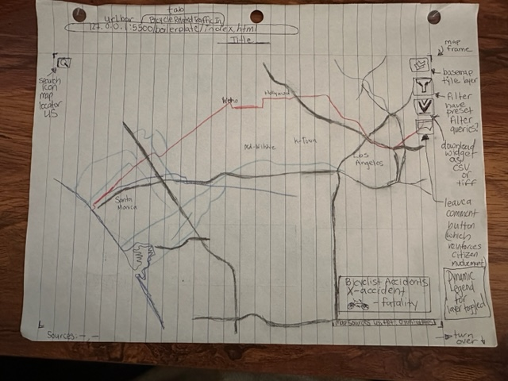
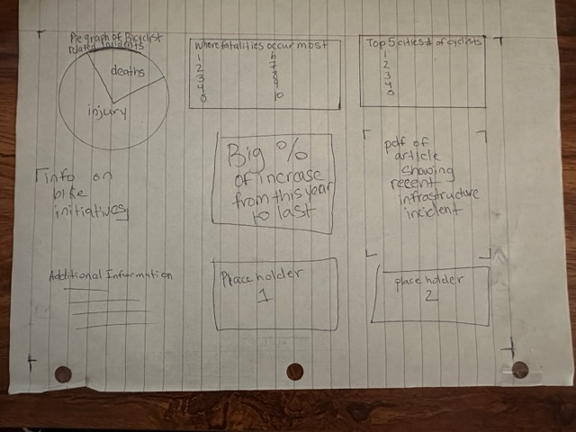

# Final Proposal

## Team Name
Team More Than Just Cars

### Team Members
Rachael Urbano and Gerald Heston

## Overview
The hypothesis is that the bicyclist- and pedestrian-related incidents are likely going to fall outside of areas that incorporate bicycle and pedestrian infrastructure, and we do not mean just "paint on the pavement." Projects supported by spatial data (where fatalities are occurring) often help cities secure needed funding from agencies like Department of Transportation or Community Development Block Grants (CDBG) funding which is determined by certain eligibilities with the Department of Housing and Urban Development.  Whether driven by curiosity or project need, a user should be able to retrieve the data they are seeking for a given area with ease.

In some instances such as Reno, the city has seen explosive growth the last two decades and the building has incorporated cyclist infrastructure with it. We are in agreement that as a country, we are a bit far off from being like Amsterdam, but people are realizing the need for change, and the benefits to everyone when there is infrastructure available. The untold benefits of a healthier society seem to not be important enough to people so instead we must plead a case. 

In Los Angeles there are bike coalitions and groups that get together regularly, promote events (such as CicLaVia where 7 miles of streets is shut down and devoted to a path for the day, this occurs 3-4x a year), they show up to public meetings regarding metro public transit, and local governance meetings as a voice to be heard. So having specific areas to bring to the attention of local governments could prove useful.

The final product will make proper use of a relevant filter, perhaps a widget would allow the data to be downloaded in csv format at the click of a button, basic geoprocessing functions (closest bike feature, clip features), and a few standard map operators such as: zoom, pan, basemap options. In this instance, with applying a filter and perhaps the clip function, a user can capture the geospatial data of accidents and fatalities in a given area and have the ability to export this data for further use.

## Persona/Scenario
Our target audience includes a wide breadth of user groups:
1. General bike enthusiasts, pedestrians, and motorits.
* A general bike enthusiast or pedestrian is curious about where bicyclist/pedestrian deaths are occurring in their community. They may want to avoid streets or intersections with a high accident rates. They might want to travel on streets/paths with low accident rates, or streets with successful bike/pedestrian infrastructre. On the flip side, a motorist may want to avoid routes with high use by bicyclists and pedestrians, just to avoid causing an accident. Also, they may want to bring certain streets/intersections to the attention of the city council or city planners for improvements.
* The general enthusiast toggle on the layers that are of interest and explore the maps. The user should be able to turn on and off layers such as accident sites, speed limits. They can search for intersections or addresses. To what level they seek to gain information would vary. Sometimes people just stumble upon things or it can be a source of inspiration.
2. City planners
* Toggling around this map will help with considerations as cities around the country the seek to pedestrianize areas. There is a growing need to utilize space in denser areas of populations. Whether it be putting in pocket parks, or slowly converting streets into bike lanes, good city planning is seeking to incorporate non-automobile related infrastructure. The city planner will assess intersections that have had a higher bicyle/pedestrian death ratio. 
* USE SCENARIO
3. Data analysts and engineers
* The more advanced user such as the city data analyst (or engineer in the planning department that looks over roads), may want to apply some spatial analysis tools such as proximity to a dedicated bike path or infrastructure, or look at a city as a whole and calculate the rate of change in the occurrences of bicyclist accidents or deaths. Engineers may want to assess the area to see if Bott’s dot’s can be used to block off a turning section for bikes.
* USE SCENARIO

## Requirements

Main layer being the point layer of accidents and deaths. The symbology we need to decide on so it isn’t so grim and also respectful. Maybe semi transparent hollow x for an accident, and a white bike with a black outline representing a death. A white bike typically symbolizes the location or severe injury of a cyclist typically by motor vehicle. This will be acquired from the NHTSA (National Highway Traffic Safety Administration), using FARS tables which contain latitude and longitude coordinates.

### Data Layers
| |Data Layer | Source | Symbology |
|-|-----------|--------|-----------|
|1|Base Map   |Mapbox, using Open Street Map attributes | Most data will be in gray monochrome to make figure layers stand out. Filtered unnecessary layers to reduce background noise. Separated cycle paths and bike paths (separated out from OSM attributes) will be highlighted in brighter colors |
|2|Census tracts | US Census Bureau | Commuter stats—census based layer symbolized based on number of commuters that do not rely on a car as their main mode of transport; Choropleth of number of workers who commute by bike ÷ total number of workers (16 and over). |
|3|Bicycle deaths 2001-2020 | Compiled from National Highway Traffic Safety Administration (NHTSA) [Fatality Analysis Reporting System (FARS)](https://www.nhtsa.gov/research-data/fatality-analysis-reporting-system-fars) | At the city/metro area scale: bicycle icon, color coded by year; At the regional scale: heatmap raster (density) |
|4|Pedestrian deaths 2001-2020 | Compiled from National Highway Traffic Safety Administration (NHTSA) [Fatality Analysis Reporting System (FARS)](https://www.nhtsa.gov/research-data/fatality-analysis-reporting-system-fars) | At the city/metro area scale: pedestrian icon, color coded by year; At the regional scale: heatmap raster (density) |
|5|Cities of Interest | US Census Bureau, Esri | Large circles with large labels |
|6|Roads with speed limit |Open Street Map |Lines with colored ramp|

## Interaction Section—widgets 
| |Widget |Description|
|-|-------|-----------|
|1|Layer control |Change the currently visible layers|
|2|Search | Allow the user to search for a city, landmark, or address |
|3|Download | Download shapefiles or text files of the accident data __(for the entire US or the current window?)__ |
|4|Bar chart| Bar chart of # of bicyclist deaths 2001-2020 in the currently displayed area or metro area |
|5|Pie chart |Pie chart of pedestrian and bicyclist deaths 2001-2020 in the currently displayed area or metro area|
|6|Story |Text describing how the highlighted city has made improvements to bike infrastructure to improve safety, from Federal Highway Admin's 2015 report and media artciles|
|7|Filter |Filter roads by speed limit, tracts by % bike commuter|
|8|Popup |When the user clicks on a feature, a formatted popup with relevant information

## Lo-fi Wireframe
Map Interface

Dashboard

## Potential info in little sections 
* [PEDSAFE: Pedestrian Safety Guide and Countermeasure Selection System](http://www.pedbikesafe.org/PEDSAFE/guide_background.cfm)
* [CDC Bicyle Safety](https://cdc.gov/transportationsafety/bicycle/index.html)
* [San Antonio Report article on bike lanes](https://sanantonioreport.org/avenue-b-and-alamo-street-bike-lanes-offer-glimpse-of-possibilities/)
* [WIRED: How to Start a Bike Bus](https://www.wired.com/story/how-to-start-a-bike-bus/)
* [Pedbikeinfo: Pedestrian and Bicycle Information Center](https://www.pedbikeinfo.org/)
* [Instagram: Cars Destroyed our Cities](https://www.instagram.com/cars.destroyed.our.cities/)
* [FARS Data explorer](https://explore.dot.gov/views/DV_FARS_PC/Home?%3Aiid=3&%3AisGuestRedirectFromVizportal=y&%3Aembed=y)
* [OpenCyleMap.org](https://www.opencyclemap.org/)
* [CycleOSM.org](https://www.cyclosm.org/#map=14/39.4830/-119.8027/cyclosm)
